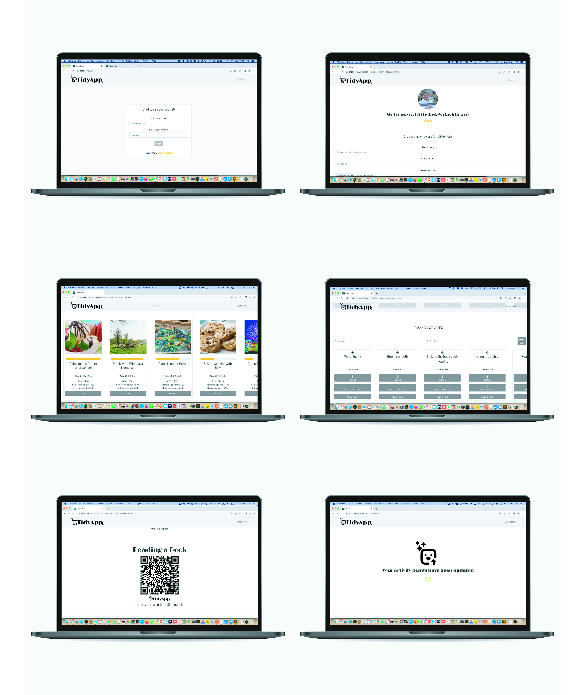

# TidyApp

TidyApp is a Web application that helps parents to teach good habits to their children through gamification. Parents can create different tasks and print QR codes. When the children scan the QR codes, the can accumulate points and retrieve rewards. 

## Screenshots

## Getting Started 

1. Clone this repo.

bash git clone https://github.com/rbrtrfl/linkup
    

2. Install dependencies in root, server and client folders

bash npm install

3. Install [MongoDB](https://www.mongodb.com/products/compass) Compas on your machine, start the program and connect the database 

## Tech Stack
* React
* Node.js
* Express
* MongoDB
* Mongoose

## To Do
<ul>
<li>Refactor code and file organization</li>
<li>Create Page with Statistic Graphics</li>
<li>Display current prices with details ater QR code is scanned</li>
<li>Add multi account possibility</li>
</ul>